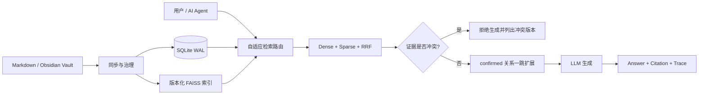

<div align="center">

# MindGraph

### Local-first Evidence Intelligence for Markdown & AI Agents

**把 Markdown / Obsidian Vault 变成可追溯、懂版本、遇到冲突会拒答的可信知识服务。**

<p>
  <a href="https://github.com/kayon0209/mindgraph/actions/workflows/ci-cd.yml"></a>
  <a href="https://github.com/kayon0209/mindgraph/stargazers"></a>
  
  
  
  
  <a href="./LICENSE"></a>
</p>

<p>
  <a href="#-60-秒体验">60 秒体验</a> ·
  <a href="#-为什么是-mindgraph">为什么是 MindGraph</a> ·
  <a href="#-mcp--ai-agent">MCP</a> ·
  <a href="#️-系统架构">架构</a> ·
  <a href="#-评测与可信边界">评测</a> ·
  <a href="./docs/PRODUCT_STRATEGY.md">路线图</a>
</p>


</div>

> **MindGraph 不是“接上文档就回答”的又一个聊天壳。**  
> 它把混合检索、受控关系扩展、制度版本、生效日期、权限与 citation 放进同一条证据链；当证据互相冲突时，系统会在调用 LLM **之前**停止生成，并把问题交还给人。

当前首个垂直场景是报销、财务与企业制度合规；底层能力同样适用于任何需要**版本治理、证据溯源和本地部署**的 Markdown 知识库。

---

## ✨ 一眼看懂

<table>
<tr>
<td width="25%" align="center"><b>🏠 Local-first</b><br><sub>SQLite + 本地索引<br>知识不必先上传 SaaS</sub></td>
<td width="25%" align="center"><b>🔎 Evidence-first</b><br><sub>回答携带 citation<br>可回到原始证据</sub></td>
<td width="25%" align="center"><b>🗓️ Version-aware</b><br><sub>理解生效期与历史版本<br>冲突时拒绝编答案</sub></td>
<td width="25%" align="center"><b>🔌 Agent-ready</b><br><sub>REST + SSE + MCP<br>接入 AI Agent 工作流</sub></td>
</tr>
</table>

### 当前能力

- **Hybrid Retrieval**：BGE / FAISS Dense + BM25 Sparse + RRF 融合
- **Adaptive Routing**：按查询意图选择 vector、sparse、hybrid、graph 或 rerank
- **Controlled Graph Expansion**：只有人工确认的关系才能进入一跳补充检索
- **Grounded Answering**：SSE 流式回答、citation、检索 trace 与证据轨道
- **Policy Lifecycle**：`policy_key`、版本、生效区间、状态和历史查询
- **Conflict-before-Generation**：多个有效版本冲突时不调用 LLM
- **Governed Access**：API Key / OIDC、workspace / department ACL 与访问审计
- **MCP Server**：让 Claude Desktop、Claude Code 等客户端读取 MindGraph
- **Evaluation Ledger**：检索消融、答案可信评分、延迟与成本进入统一账本
- **Web Workspace**：问答、制度台账、关系审核和评测对比

---

## 🎯 为什么是 MindGraph？

普通 RAG 往往只回答“哪段文字最像问题”，但在高风险知识场景里，真正困难的是：

| 问题 | 常规 RAG | MindGraph |
|---|---|---|
| 新旧制度同时存在 | 可能混着回答 | 按查询日期过滤版本 |
| 两个版本都显示有效 | 让 LLM 自己判断 | 生成前返回 `conflicting_evidence` |
| 语义相似但关系未经确认 | 容易污染上下文 | 仅扩展 `confirmed` 关系 |
| 用户无权查看某条证据 | 可能通过检索泄漏 | 检索、关系与 MCP 共用 ACL |
| 回答看起来正确 | 很难验证 | citation + trace 回到原文 |
| 质量是否真的提升 | 依赖主观感受 | 固定数据集 + 可重复评测 |

这也是项目当前最核心的设计原则：

> **先治理证据，再生成答案。**

---

## 🚀 60 秒体验

### 路径 A：无需密钥的离线验收

公开 `demo-vault/` 包含合成的企业制度、工作流和案例。下面的命令会在临时目录中完成同步、索引、Hybrid 检索、confirmed 关系扩展与消融验证，结束后自动清理。

```bash
git clone https://github.com/kayon0209/mindgraph.git
cd mindgraph

python -m venv .venv
source .venv/bin/activate              # Windows: .venv\Scripts\activate
pip install -r requirements.txt

python scripts/validate_mindgraph_offline.py
```

> 离线验收使用确定性的 Fake Embedding / Fake LLM，只证明工程链路可复现，不代表真实模型效果。

### 路径 B：启动完整 Web 工作台

```bash
cp .env.example .env                   # Windows: Copy-Item .env.example .env
# 按需填写 .env 中的模型 Provider 配置

docker compose up --build
```

| 服务 | 地址 |
|---|---|
| Web Workspace | <http://127.0.0.1:3000> |
| API | <http://127.0.0.1:8000> |
| OpenAPI Docs | <http://127.0.0.1:8000/api/docs> |
| Health | <http://127.0.0.1:8000/api/v1/health> |

---

## 🧭 核心工作流



1. 扫描 Vault，用稳定 ID 与内容哈希识别新增、修改和删除。
2. 将正文、治理字段与 ACL 写入 SQLite，并原子切换版本化索引。
3. 路由器理解查询意图，选择合适的检索策略。
4. Dense 与 Sparse 结果经 RRF 融合，按需重排。
5. 状态、生效期、分类和权限过滤贯穿基础检索与关系扩展。
6. 若同一 `policy_key` 命中多个有效版本，系统在生成前停止。
7. 正常回答通过 SSE 返回 citation 与检索 trace。

---

## 🔌 MCP × AI Agent

MindGraph 内置只读 MCP Server，可作为 AI Agent 的本地证据层。当前提供 5 个工具：

| Tool | 用途 |
|---|---|
| `mindgraph_list_notes` | 列出当前身份可见的笔记 |
| `mindgraph_get_note` | 获取单篇笔记及治理元数据 |
| `mindgraph_search` | 搜索可见知识并返回证据 |
| `mindgraph_list_relations` | 查看双端均可见的已确认关系 |
| `mindgraph_evaluation_overview` | 获取评测运行概览 |

启动 stdio Server：

```bash
# macOS / Linux
PYTHONPATH=src MCP_PRINCIPAL=local-user python -m mcp_server

# Windows PowerShell
$env:PYTHONPATH="src"
$env:MCP_PRINCIPAL="local-user"
python -m mcp_server
```

HTTP 端点：

```text
POST /api/v1/mcp
GET  /api/v1/mcp/tools
GET  /api/v1/mcp/health
```

> 当前 MCP 工具全部只读；关系提议和写回能力仍在路线图中。每次调用都会进入访问审计。

---

## 🏷️ 用 Frontmatter 治理知识

MindGraph 仍以普通 Markdown 为源数据。对制度类文档，建议登记以下字段：

```yaml
---
policy_key: expense.general
owner: 财务运营部
version: "2.0"
status: active
effective_from: 2026-07-01
effective_to: 2027-06-30
---
```

- `policy_key`：跨版本稳定的制度族标识；V1 / V2 / V3 使用相同值。
- `status`：支持 `draft`、`active`、`expired`、`superseded`、`archived`。
- 缺失字段不会阻断同步，但会在制度台账中标记为待治理。
- 元数据变化会触发重新索引，历史版本仍可按查询日期检索。

同步自己的 Vault：

```bash
python scripts/sync_vault.py --vault "/path/to/your/vault"
```

Obsidian 客户端见 [`obsidian-plugin/README.md`](obsidian-plugin/README.md)。

---

## 🏗️ 系统架构

<div align="center">
  
</div>

```text
src/
├── api/               FastAPI 路由、认证与 SSE
├── application/       用例编排、路由、冲突治理与 Vault 同步
├── domain/            领域模型与错误
├── infrastructure/    SQLite、Provider、解析器与配置
└── retrieval/         Dense、Sparse、RRF、重排与关系扩展

web/                   React Web Workspace
obsidian-plugin/       Obsidian 客户端
evaluation/            数据集与评测逻辑
demo-vault/            可公开复现的合成知识库
archive/legacy-rag/     历史报销 RAG 实现
```

当前生产 API 入口是 `src/api/main.py`；`src/retrieval/` 是活跃核心，而不是历史遗留目录。

---

## 📊 评测与可信边界

```bash
# 检索层：BM25 / Hybrid / Hybrid + Graph
python scripts/run_ablation.py

# 路由层
python scripts/run_routing_evaluation.py

# 回答层
python scripts/run_answer_evaluation.py --live --strategy hybrid
```

当前 `evaluation/datasets/mindgraph_golden.jsonl` 是 12 条人工编写、与运行关系库独立的冻结样本，覆盖：

- 版本替代与历史查询
- 审批阈值和例外
- 跨制度组合
- 无答案与歧义
- citation、拒答、必需事实与禁用事实
- P95 延迟、Token 与成本口径

### 我们不会夸大的部分

- 12 条样本只适合确定性回归，**不能**证明生产效果。
- 当前关系候选主要来自笔记级语义相似度，只有人工确认关系进入检索。
- 当前准确描述是**带人工确认关系扩展的 Hybrid RAG**，不是完整的实体消歧、多跳推理或社区摘要系统。
- Fake Embedding / Fake LLM 只用于离线工程验收，不会被 Web 冒充为生产能力。

---

## 🗺️ 项目状态

| 已完成 | 下一步 | 后续探索 |
|---|---|---|
| Hybrid 检索与 RRF | 扩展 100+ 分层 Golden Set | Typed policy edges |
| 自适应检索路由 | MCP 关系提议与写回 | 实体—事件双图 |
| 版本冲突生成前拦截 | 完整 Ruff / mypy 门禁 | 社区发现与摘要 |
| ACL / OIDC / 审计 | 活跃核心覆盖率提升 | 多跳图推理 |
| Web / Obsidian / MCP | 一键 Agent 配置 | 更多企业连接器 |

完整边界和演进计划见 [`docs/PRODUCT_STRATEGY.md`](docs/PRODUCT_STRATEGY.md)。

---

## 📚 文档

- [产品边界与升级路线](docs/PRODUCT_STRATEGY.md)
- [当前架构与落地说明](docs/MindGraph-ARCH.md)
- [部署指南](docs/DEPLOYMENT.md)
- [检索成本效率分析](docs/MindGraph-cost-efficiency.md)
- [Obsidian 插件](obsidian-plugin/README.md)
- [历史报销 RAG PRD](archive/legacy-rag/docs/PRD-v2.md)

---

## 🧪 开发验证

```bash
python -m pytest
ruff check src scripts tests --select F821,F822,F823,E902

cd web
pnpm typecheck
pnpm test
pnpm build
```

当前 CI 覆盖率门槛为 55%。全量 Ruff、格式遗留、mypy 阻断和更高覆盖率仍是显式偿债项，而不是已经完成的质量声明。

---

## 🤝 参与项目

欢迎提交 bug、可复现评测样本、文档改进和小而清晰的 Pull Request。

特别欢迎这些方向：

- 更真实且可公开的企业制度 Golden Cases
- Claude Desktop / Claude Code / Cursor 的 MCP 配置示例
- Obsidian 日常工作流与使用案例
- 检索、权限或版本治理方面的边界测试
- README 英文版与演示 GIF

<div align="center">

如果 MindGraph 对你有启发，欢迎点一个 ⭐，让更多人看到“证据优先”的本地知识系统。

[Report Bug](https://github.com/kayon0209/mindgraph/issues) · [Read the Roadmap](docs/PRODUCT_STRATEGY.md) · [View the License](LICENSE)

<br>

**MIT License**

</div>
