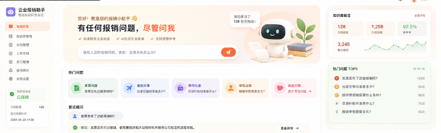

# 企业报销智能问答系统 · Expense RAG QA

> 基于 RAG 的企业报销政策问答与可复现评测系统：本地 BGE 向量化 + FAISS/BM25 混合检索 + RRF 融合 + 可选重排，生成端兼容 OpenAI 协议。

[](https://python.org)
[](https://fastapi.tiangolo.com)
[](https://streamlit.io)
[](./LICENSE)

## 目录

- [功能特性](#功能特性)
- [技术架构](#技术架构)
- [快速开始](#快速开始)
- [评测](#评测)
- [项目结构](#项目结构)
- [文档](#文档)
- [License](#license)

## 功能特性

- 💬 **自然语言问答**：员工用日常语言提问，无需记忆关键词或菜单路径
- 📚 **答案带引用**：每个回答标注来源文档与片段，可溯源、抑制幻觉
- 🛡️ **安全护栏**：自动拒答薪资 / 考勤 / 个人隐私等非报销类问题，内置 PII 检测与敏感词过滤
- 📥 **多格式知识库**：Markdown / TXT / PDF / DOCX / XLSX 独立解析器 + 结构化切片
- 🗂️ **版本化知识库**：文档状态机、Embedding 复用、版本化索引、原子切换与指针回滚（上线零停机）
- 🔍 **多检索策略**：Dense / Sparse / Hybrid / RRF 四策略可选，可选 Cross-Encoder 重排提升精度
- 🔌 **多 LLM Provider**：DeepSeek / OpenAI-compatible，Zhipu / Anthropic 可选，运行时可切换并自动降级
- ⚡ **流式回答**：SSE 实时逐字输出
- 📊 **可复现评测**：34 题 Gold 数据集（含文档与 Chunk 标签），支持 `recall@k` / `MRR` 与消融实验

## 技术架构

```
Streamlit UI
   │  (HTTP + SSE)
   ▼
FastAPI  ──► ChatService ──► RAG Engine
                               ├─ Retriever : FAISS(Dense) + BM25(Sparse) + RRF 融合
                               ├─ ReRanker  : Cross-Encoder（可选）
                               └─ Generator : OpenAI-compatible LLM
   │
   ├─ KnowledgeService : 文档解析 / 版本化索引 / 回滚
   └─ Evaluation       : retrieval_eval / baseline / ablation
```

| 组件 | 技术 |
|------|------|
| 前端 | Streamlit 1.28+ |
| API | FastAPI + SSE |
| 稠密检索 | FAISS |
| 稀疏检索 | BM25（自定义分词） |
| 融合 | RRF（Reciprocal Rank Fusion） |
| 重排 | Cross-Encoder（可选） |
| Embedding | `BAAI/bge-small-zh-v1.5`（可配置，支持本地离线） |
| 生成 | DeepSeek / OpenAI-compatible；Zhipu / Anthropic 可选 |
| 存储 | SQLite（WAL）+ 向量索引文件 |

## 快速开始

```bash
# 1. 克隆并进入项目
git clone https://github.com/kayon0209/expense-rag-qa.git
cd expense-rag-qa

# 2. 创建虚拟环境并安装依赖
python -m venv .venv
source .venv/bin/activate        # Windows: .venv\Scripts\activate
pip install -r requirements.txt

# 3. 配置（复制模板后填入 API Key；.env 含密钥，已被 .gitignore 忽略）
cp .env.example .env

# 4. 构建检索索引（首次需本地 BGE 模型；BGE_LOCAL_FILES_ONLY=true 时请确保模型已就位）
python -m evaluation.retrieval_eval build-index --version local-v1

# 5. 启动服务（两个终端）
uvicorn api.main:app --app-dir src --host 127.0.0.1 --port 8000   # 终端一
streamlit run streamlit_app.py --server.port 8501                # 终端二
```

访问 http://localhost:8501 ；API 文档见 http://localhost:8000/docs 。

## 评测

```bash
python -m evaluation.baseline --validate-only                            # 仅校验数据集与 Gold 标签
python -m evaluation.retrieval_eval compare --repetitions 3 --warmups 1  # 四策略对照
python -m unittest discover -s tests -v                                  # 单元测试
```

> 34 题小样本来自开发过程，用于工程可复现验证，**不代表生产效果**。生产上线前需在目标语料上重跑评测并固化 BGE 模型。

## 项目结构

```
expense-rag-qa/
├── knowledge/          # 初始知识库文档
├── src/                # 源代码（api / application / retrieval / infrastructure）
├── evaluation/         # 评测系统（retrieval_eval / baseline / ablation）
├── tests/              # 单元测试
├── docs/
│   └── PRD-v2.md       # 产品需求文档（重构后 v3.1）
├── assets/             # 截图资源
└── .env.example        # 配置模板（无密钥）
```

## 界面预览



## 文档

- [产品需求文档 PRD v2（重构后）](./docs/PRD-v2.md)

## License

[MIT](./LICENSE) —— 详见 [LICENSE](./LICENSE) 文件。
