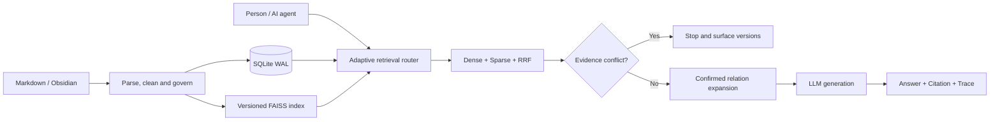

<div align="center">

# MindGraph

### Local-first evidence intelligence for Markdown and AI agents

**Find the right source. Respect versions and permissions. Stop when evidence conflicts. Answer with citations.**

<p>
  <a href="./README.md">English</a> · <a href="./README.zh-CN.md">简体中文</a>
</p>

<p>
  <a href="https://github.com/kayon0209/mindgraph/actions/workflows/ci-cd.yml"></a>
  <a href="https://github.com/kayon0209/mindgraph/stargazers"></a>
  
  
  
  <a href="./LICENSE"></a>
</p>

<p>
  <a href="#why-mindgraph">Why MindGraph</a> ·
  <a href="#features">Features</a> ·
  <a href="#tech-stack">Tech Stack</a> ·
  <a href="#quickstart">Quickstart</a> ·
  <a href="#usage-mcp">MCP</a> ·
  <a href="#architecture">Architecture</a> ·
  <a href="#evaluation-and-boundaries">Evaluation</a> ·
  <a href="#faq">FAQ</a>
</p>


</div>

MindGraph turns a Markdown or Obsidian vault into a local evidence layer for people and AI agents. It combines hybrid retrieval with version, lifecycle, access-control, conflict and citation checks—so an answer is generated only when the evidence is fit to support it.

The first vertical is policy-heavy knowledge such as expense, finance and compliance. The same evidence pipeline can support any Markdown knowledge base where freshness, permissions and traceability matter.

## Why MindGraph

**The failure MindGraph is built for:** *Which expense deadline applies on 2026-08-18: 30 days or 60 days?*

| Generic RAG | MindGraph |
|---|---|
| May retrieve the semantically similar but archived 60-day policy | Filters evidence by status and effective date |
| May silently mix two active versions | Returns `conflicting_evidence` before calling the LLM |
| Produces a fluent answer with unclear provenance | Returns the source, version, date and retrieval trace |

> **MindGraph's product principle: govern the evidence before generating the answer.**

<div align="center">

| | | | |
|---|---|---|---|
| **Local-first**<br><sub>SQLite and local indexes<br>Keep knowledge under your control</sub> | **Evidence-first**<br><sub>Citations and retrieval traces<br>Return to the original source</sub> | **Version-aware**<br><sub>Lifecycle and effective dates<br>Stop on conflicting evidence</sub> | **Agent-ready**<br><sub>REST, SSE and MCP<br>Use from agent workflows</sub> |

</div>

## Features

### Retrieval & routing

- **Hybrid retrieval:** BGE / FAISS dense search + BM25 sparse search + RRF fusion
- **Adaptive routing:** selects an appropriate retrieval strategy from query intent
- **Controlled graph expansion:** only human-confirmed relations can add evidence; graph gating keeps the default path disabled when ablation shows no real gain

### Evidence & governance

- **Grounded answers:** streaming responses with citations and retrieval traces
- **Policy lifecycle:** stable `policy_key`, version, status and effective-date filtering
- **Conflict-before-generation:** conflicting active versions stop the LLM call
- **Governed access:** API key / OIDC, workspace / department ACLs and audit logs

### Interfaces & evaluation

- **Web and Obsidian clients:** ask, inspect evidence, review relations and compare runs
- **Agent-ready APIs:** REST, SSE and a read-only MCP server
- **Evaluation ledger:** retrieval, answer trust, routing, graph gate, latency and cost in one history

## Tech Stack

| Layer | Technology |
|---|---|
| Runtime | Python 3.11+ |
| API | FastAPI (REST + SSE), MCP server |
| Retrieval | BGE embeddings · FAISS (dense) · BM25 (sparse) · RRF fusion |
| Storage | SQLite (WAL), versioned FAISS index |
| Clients | Web workspace (Streamlit), Obsidian plugin |
| Quality | pytest, Ruff, mypy (see `docs/DEPLOYMENT.md`) |

## Quickstart

> **Prerequisite:** Python 3.11 or newer.

### Option A: verify the pipeline without keys

The public `demo-vault/` contains synthetic policies, workflows and cases. This command verifies sync, indexing, hybrid retrieval, confirmed-relation expansion and ablation in a temporary directory.

```bash
git clone https://github.com/kayon0209/mindgraph.git
cd mindgraph

python -m venv .venv
source .venv/bin/activate              # Windows: .venv\Scripts\activate
pip install -r requirements.txt
python scripts/validate_mindgraph_offline.py
```

The offline check uses deterministic fake embeddings and a fake LLM. It proves that the engineering path is reproducible; it does not claim real-model quality.

### Option B: start the Web workspace

```bash
cp .env.example .env                   # Windows: Copy-Item .env.example .env
# Configure a model provider in .env when you want real answers.
docker compose up --build
```

| Service | URL |
|---|---|
| Web workspace | <http://127.0.0.1:3000> |
| API | <http://127.0.0.1:8000> |
| OpenAPI docs | <http://127.0.0.1:8000/api/docs> |

## Usage (MCP)

MindGraph exposes a read-only MCP server with five tools:

| Tool | Purpose |
|---|---|
| `mindgraph_list_notes` | List notes visible to the current principal |
| `mindgraph_get_note` | Read one visible note and its governance metadata |
| `mindgraph_search` | Search knowledge and return evidence |
| `mindgraph_list_relations` | List confirmed relations whose endpoints are both visible |
| `mindgraph_evaluation_overview` | Inspect evaluation-run summaries |

Start the stdio server:

```bash
PYTHONPATH=src MCP_PRINCIPAL=local-user python -m mcp_server
```

Claude Desktop–style configuration:

```json
{
  "mcpServers": {
    "mindgraph": {
      "command": "python",
      "args": ["-m", "mcp_server"],
      "env": {
        "PYTHONPATH": "/absolute/path/to/mindgraph/src",
        "MCP_PRINCIPAL": "local-user"
      }
    }
  }
}
```

MCP is intentionally read-only today. Reviewed relation proposals, evidence feedback and evaluation-case write-back are on the roadmap.

## Architecture



Status, effective-date, category and permission filters are shared by base retrieval and relation expansion. This prevents an archived document from re-entering a current answer through a graph edge.

<div align="center">
  
</div>

## Repository layout

```text
src/
  api/            FastAPI routes, auth, OIDC, middleware, MCP mount
  application/    Application services (orchestration, chat, lifecycle)
  domain/         Stable models, errors and interfaces
  infrastructure/ Adapters: SQLite, parsers, model SDKs
  retrieval/      Retrieval stages: embeddings, dense, sparse, fusion, pipeline
  ui/             Streamlit client (api_client.py is the only backend entry)
evaluation/       Golden dataset, retrieval/answer/routing/ablation evaluation
demo-vault/       Public synthetic policies, workflows and cases
docs/             Architecture, deployment, product strategy and ADRs
scripts/          Validation, evaluation and ingestion utilities
tests/            Regression and contract tests (pytest)
web/              Web workspace
obsidian-plugin/  Obsidian client
```

## Evaluation and boundaries

```bash
python scripts/run_ablation.py
python scripts/run_routing_evaluation.py
python scripts/run_answer_evaluation.py --live --strategy hybrid
```

The current frozen set (`mindgraph_golden_v2.jsonl`, version `2.4.0`) contains 90 approved cases derived from the synthetic demo vault and public handbooks. It covers replacement, thresholds, exceptions, cross-policy questions, multi-condition cases, exact facts, graph-needed controls, ACL-restricted cases, no-answer cases, synonym/abbreviation and ambiguity. Retrieval reports Recall@K, Precision@K, MRR and nDCG@K with per-query_type/difficulty stratification; answer evaluation reports citation F1, refusal correctness, version validity, required facts, forbidden facts, ACL leakage, conflict accuracy, latency, tokens and estimated cost. These are local development/regression measurements, not production benchmark claims.

### What MindGraph is today

- A local-first Hybrid RAG system with controlled, human-confirmed relation expansion
- Version-aware, citation-first and MCP-ready
- Reproducible with a public synthetic vault and deterministic offline checks

### What it is not yet

- A complete entity-disambiguation and multi-hop knowledge-graph engine
- A hosted enterprise SaaS or a production-certified benchmark; the current 90 cases are local development/regression tests

## Project status

| Now | Next | Later |
|---|---|---|
| Hybrid retrieval and adaptive routing | Structure-aware chunk inspection | Typed policy edges |
| Version-conflict interception | Golden set → 60–80 layered cases (currently 90, plan minimums met) | Entity-event dual graph |
| ACL, OIDC and audit | Evidence feedback and writable MCP proposals | Community discovery |
| Web, Obsidian and read-only MCP | Stronger Ruff, mypy and coverage gates | Multi-hop reasoning |

See [`docs/PRODUCT_STRATEGY.md`](docs/PRODUCT_STRATEGY.md) for the product boundary and roadmap.

## FAQ

**Does MindGraph require a model provider or API key?**

No. The offline validation path (`Option A`) runs with deterministic fake embeddings and a fake LLM. You only configure a model provider in `.env` when you want real, grounded answers.

**Why is MCP read-only?**

MindGraph treats evidence as governed data. Writable operations (relation proposals, evidence feedback, evaluation write-back) are deliberately deferred to the roadmap so that an agent cannot silently modify the evidence layer.

**How does MindGraph differ from a plain RAG pipeline?**

It adds governance before generation: version/effective-date filters, ACL enforcement, conflict interception, and citations with retrieval traces. See [Why MindGraph](#why-mindgraph) for the failure scenario it addresses.

**Where does the evaluation data come from?**

The frozen golden set (`2.4.0`, 90 cases) is derived from the public synthetic `demo-vault/` and public handbooks. Metrics are local development/regression measurements, not production benchmark claims.

## Documentation

- [Product strategy and roadmap](docs/PRODUCT_STRATEGY.md)
- [Architecture](docs/MindGraph-ARCH.md)
- [Deployment](docs/DEPLOYMENT.md)
- [Retrieval cost and efficiency](docs/MindGraph-cost-efficiency.md)
- [Obsidian plugin](obsidian-plugin/README.md)

## Contributing

Issues, reproducible evaluation cases, documentation improvements and small focused pull requests are welcome. Especially useful contributions include real-but-shareable policy cases, MCP client examples, Obsidian workflows and retrieval or access-control boundary tests.

<div align="center">

If evidence-first local knowledge systems are useful to you, consider giving MindGraph a star.

[Report an issue](https://github.com/kayon0209/mindgraph/issues) · [Read the roadmap](docs/PRODUCT_STRATEGY.md) · [MIT License](LICENSE)

</div>
