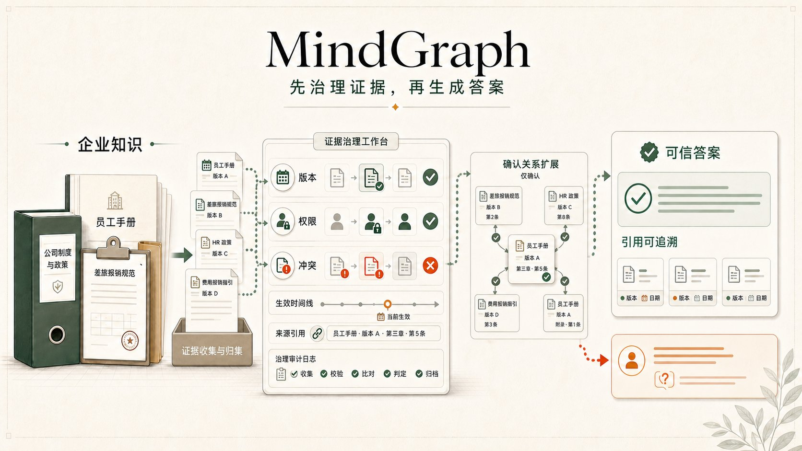
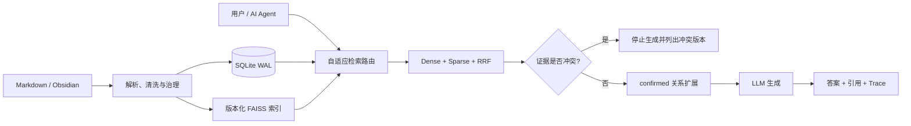
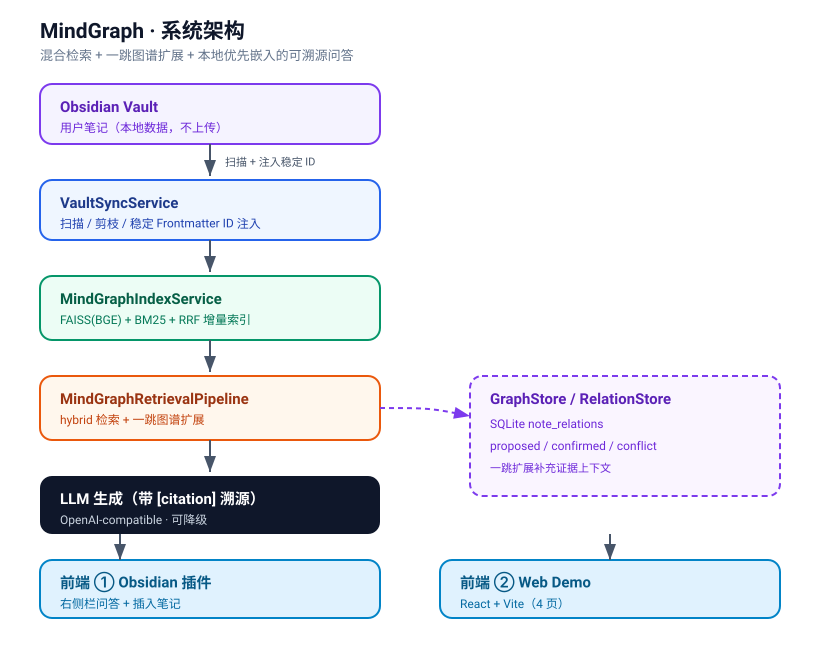

<div align="center">

# MindGraph

### 面向 Markdown 与 AI Agent 的本地优先证据层

**找到正确证据，识别有效版本，遵守权限边界；证据冲突时停止生成，正常回答时提供可追溯引用。**

<p>
  <a href="./README.md">English</a> · <a href="./README.zh-CN.md">简体中文</a>
</p>

<p>
  <a href="https://github.com/kayon0209/mindgraph/actions/workflows/ci-cd.yml"></a>
  <a href="https://github.com/kayon0209/mindgraph/stargazers"></a>
  
  
  
  <a href="./LICENSE"></a>
</p>

<p>
  <a href="#快速开始">快速开始</a> ·
  <a href="#为什么是-mindgraph">为什么是 MindGraph</a> ·
  <a href="#mcp--ai-agent">MCP</a> ·
  <a href="#工作原理">架构</a> ·
  <a href="#评测与可信边界">评测</a> ·
  <a href="./docs/PRODUCT_STRATEGY.md">路线图</a>
</p>



</div>

MindGraph 把 Markdown 或 Obsidian Vault 变成人与 AI Agent 都能使用的本地证据层。它将混合检索与版本、生命周期、权限、冲突和引用检查放进同一条链路——只有当证据足以支撑答案时，才让 LLM 开始生成。

当前首个垂直场景是报销、财务与企业制度合规；同一套证据链也适用于任何重视时效、权限和可追溯性的 Markdown 知识库。

## MindGraph 要解决的典型错误

**问题：** 2026 年 8 月发生的费用，应该遵循 30 天还是 60 天报销规则？

| 普通 RAG | MindGraph |
|---|---|
| 可能召回语义相近但已经归档的 60 天规则 | 根据状态和生效日期过滤证据 |
| 两个版本同时有效时，可能混在一起回答 | 在调用 LLM 前返回 `conflicting_evidence` |
| 答案流畅，但很难确认来自哪个版本 | 返回来源、版本、日期与检索 trace |

> **MindGraph 的产品原则：先治理证据，再生成答案。**

## 为什么是 MindGraph

<table>
<tr>
<td width="25%" align="center"><b>本地优先</b><br><sub>SQLite + 本地索引<br>知识保留在自己的环境</sub></td>
<td width="25%" align="center"><b>证据优先</b><br><sub>Citation + 检索 trace<br>随时回到原始来源</sub></td>
<td width="25%" align="center"><b>理解版本</b><br><sub>生命周期与生效日期<br>证据冲突时停止生成</sub></td>
<td width="25%" align="center"><b>Agent-ready</b><br><sub>REST + SSE + MCP<br>接入 Agent 工作流</sub></td>
</tr>
</table>

- **混合检索**：BGE / FAISS Dense + BM25 Sparse + RRF 融合
- **自适应路由**：根据问题意图选择合适的检索策略
- **受控关系扩展**：只有人工确认的关系才能补充证据；当消融没有带来真实增益时，默认图路径保持关闭
- **可溯源回答**：SSE 流式输出、citation 与检索 trace
- **制度生命周期**：稳定 `policy_key`、版本、状态和生效日期过滤
- **生成前冲突检测**：多个有效版本冲突时不调用 LLM
- **权限治理**：API Key / OIDC、workspace / department ACL 与审计日志
- **评测账本**：检索、答案可信度、路由、图门槛、延迟和成本统一留档
- **Web 与 Obsidian**：问答、检查证据、审核关系和比较评测结果

## 快速开始

### 路径 A：无需密钥验证完整链路

公开 `demo-vault/` 包含合成的制度、工作流和案例。以下命令会在临时目录中验证同步、索引、Hybrid 检索、confirmed 关系扩展和消融流程。

```bash
git clone https://github.com/kayon0209/mindgraph.git
cd mindgraph

python -m venv .venv
source .venv/bin/activate              # Windows: .venv\Scripts\activate
pip install -r requirements.txt
python scripts/validate_mindgraph_offline.py
```

离线验收使用确定性的 Fake Embedding / Fake LLM，只证明工程链路可复现，不代表真实模型质量。

### 路径 B：启动完整 Web 工作台

```bash
cp .env.example .env                   # Windows: Copy-Item .env.example .env
# 需要真实回答时，在 .env 中配置模型 Provider。
docker compose up --build
```

| 服务 | 地址 |
|---|---|
| Web 工作台 | <http://127.0.0.1:3000> |
| API | <http://127.0.0.1:8000> |
| OpenAPI 文档 | <http://127.0.0.1:8000/api/docs> |

## 工作原理



状态、生效日期、分类和权限过滤同时作用于基础检索与关系扩展，避免已归档文档通过图关系重新进入当前答案。

<div align="center">
  
</div>

## MCP × AI Agent

MindGraph 内置只读 MCP Server，目前提供五个工具：

| Tool | 用途 |
|---|---|
| `mindgraph_list_notes` | 列出当前身份可见的笔记 |
| `mindgraph_get_note` | 读取单篇笔记及治理信息 |
| `mindgraph_search` | 搜索知识并返回证据 |
| `mindgraph_list_relations` | 查看双端均可见的确认关系 |
| `mindgraph_evaluation_overview` | 查看评测运行摘要 |

启动 stdio Server：

```bash
PYTHONPATH=src MCP_PRINCIPAL=local-user python -m mcp_server
```

Claude Desktop 风格配置：

```json
{
  "mcpServers": {
    "mindgraph": {
      "command": "python",
      "args": ["-m", "mcp_server"],
      "env": {
        "PYTHONPATH": "/absolute/path/to/mindgraph/src",
        "MCP_PRINCIPAL": "local-user"
      }
    }
  }
}
```

当前 MCP 有意保持只读。经过审核的关系提议、证据反馈和评测案例写回仍在路线图中。

## 评测与可信边界

```bash
python scripts/run_ablation.py
python scripts/run_routing_evaluation.py
python scripts/run_answer_evaluation.py --live --strategy hybrid
```

当前冻结集（`mindgraph_golden_v2.jsonl`，版本 `2.2.0`）包含 12 条人工编写的制度案例，覆盖版本替代、审批阈值、例外、跨制度问题、无答案和歧义。评测 citation F1、拒答正确性、版本有效性、必需事实、禁用事实、延迟、Token 与估算成本。

### MindGraph 现在是什么

- 带人工确认关系扩展的本地优先 Hybrid RAG
- 版本感知、引用优先并支持 MCP
- 提供公开合成 Vault 与确定性离线验收

### MindGraph 还不是什么

- 完整的实体消歧和多跳知识图谱引擎
- 经大规模 Benchmark 证明可用于生产的系统——当前 12 条仅够做回归
- 云托管企业 SaaS

## 项目状态

| 已完成 | 下一步 | 后续探索 |
|---|---|---|
| Hybrid 检索与自适应路由 | 结构感知分片检查 | Typed policy edges |
| 版本冲突生成前拦截 | Golden 集 50 → 60–80 条分层案例 | 实体—事件双图 |
| ACL、OIDC 与审计 | 证据反馈与可写 MCP 提议 | 社区发现 |
| Web、Obsidian 与只读 MCP | 更完整的 Ruff、mypy 与覆盖率门禁 | 多跳推理 |

产品边界和完整路线见 [`docs/PRODUCT_STRATEGY.md`](docs/PRODUCT_STRATEGY.md)。

## 文档

- [产品策略与路线图](docs/PRODUCT_STRATEGY.md)
- [当前架构](docs/MindGraph-ARCH.md)
- [部署指南](docs/DEPLOYMENT.md)
- [检索成本与效率](docs/MindGraph-cost-efficiency.md)
- [Obsidian 插件](obsidian-plugin/README.md)

## 参与项目

欢迎提交 Issue、可复现评测案例、文档改进和小而清晰的 Pull Request。特别欢迎真实但可公开的制度案例、MCP 客户端配置、Obsidian 工作流，以及检索和权限边界测试。

<div align="center">

如果证据优先的本地知识系统对你有帮助，欢迎给 MindGraph 一个 Star。

[报告问题](https://github.com/kayon0209/mindgraph/issues) · [查看路线图](docs/PRODUCT_STRATEGY.md) · [MIT License](LICENSE)

</div>
