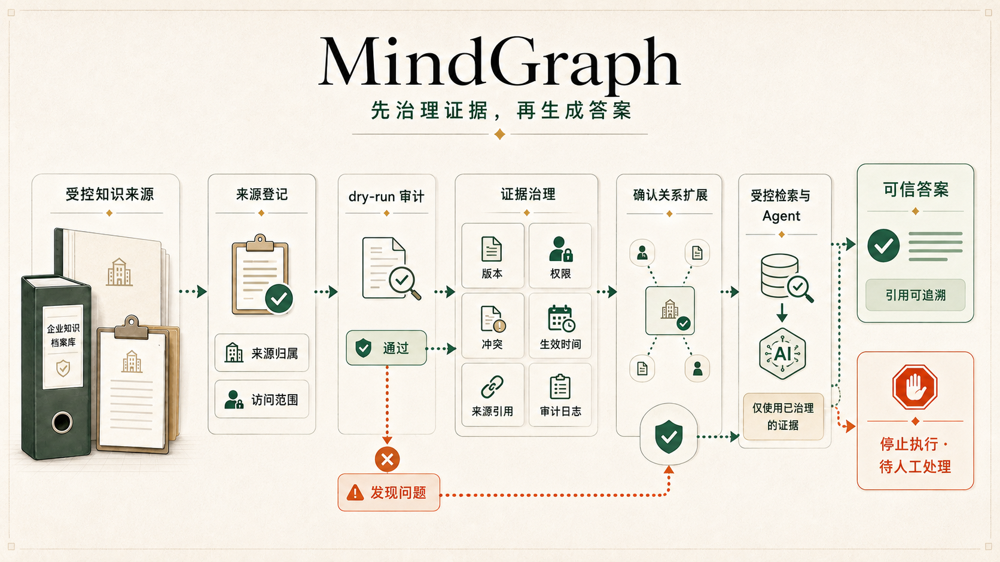
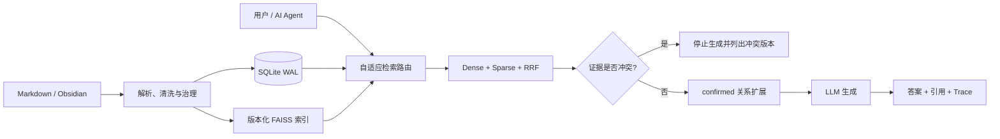

<div align="center">

# MindGraph

### 面向 Markdown 与 AI Agent 的本地优先证据层

**找到正确证据，识别有效版本，遵守权限边界；证据冲突时停止生成，正常回答时提供可追溯引用。**

<p>
  <a href="./README.md">English</a> · <a href="./README.zh-CN.md">简体中文</a>
</p>

<p>
  <a href="https://github.com/kayon0209/mindgraph/actions/workflows/ci-cd.yml"></a>
  <a href="https://github.com/kayon0209/mindgraph/stargazers"></a>
  
  
  
  <a href="./LICENSE"></a>
</p>

<p>
  <a href="#为什么是-mindgraph">为什么是 MindGraph</a> ·
  <a href="#功能特性">功能特性</a> ·
  <a href="#技术栈">技术栈</a> ·
  <a href="#快速开始">快速开始</a> ·
  <a href="#使用说明mcp">MCP</a> ·
  <a href="#架构">架构</a> ·
  <a href="#评测与可信边界">评测</a> ·
  <a href="#常见问题">FAQ</a>
</p>



</div>

MindGraph 把 Markdown 或 Obsidian Vault 变成人与 AI Agent 都能使用的本地证据层。它将混合检索与版本、生命周期、权限、冲突和引用检查放进同一条链路——只有当证据足以支撑答案时，才让 LLM 开始生成。

当前首个垂直场景是报销、财务与企业制度合规；同一套证据链也适用于任何重视时效、权限和可追溯性的 Markdown 知识库。

## 为什么是 MindGraph

**MindGraph 要解决的典型错误：** *2026 年 8 月发生的费用，应该遵循 30 天还是 60 天报销规则？*

| 普通 RAG | MindGraph |
|---|---|
| 可能召回语义相近但已经归档的 60 天规则 | 根据状态和生效日期过滤证据 |
| 两个版本同时有效时，可能混在一起回答 | 在调用 LLM 前返回 `conflicting_evidence` |
| 答案流畅，但很难确认来自哪个版本 | 返回来源、版本、日期与检索 trace |

> **MindGraph 的产品原则：先治理证据，再生成答案。**

<div align="center">

| | | | |
|---|---|---|---|
| **本地优先**<br><sub>SQLite + 本地索引<br>知识保留在自己的环境</sub> | **证据优先**<br><sub>Citation + 检索 trace<br>随时回到原始来源</sub> | **理解版本**<br><sub>生命周期与生效日期<br>证据冲突时停止生成</sub> | **Agent-ready**<br><sub>REST + SSE + MCP<br>接入 Agent 工作流</sub> |

</div>

## 功能特性

### 检索与路由

- **混合检索**：BGE / FAISS Dense + BM25 Sparse + RRF 融合
- **自适应路由**：根据问题意图选择合适的检索策略
- **受控关系扩展**：只有人工确认的关系才能补充证据；当消融没有带来真实增益时，默认图路径保持关闭

### 证据与治理

- **可溯源回答**：SSE 流式输出、citation 与检索 trace
- **制度生命周期**：稳定 `policy_key`、版本、状态和生效日期过滤
- **生成前冲突检测**：多个有效版本冲突时不调用 LLM
- **权限治理**：API Key / OIDC、workspace / department ACL 与审计日志

### 接口与评测

- **Web 与 Obsidian 客户端**：问答、检查证据、审核关系和比较评测结果
- **Agent 执行**：REST/SSE、受 feature flag 约束的后台任务与受治理 MCP 工具
- **评测账本**：检索、答案可信度、路由、图门槛、延迟和成本统一留档

## 技术栈

| 分层 | 技术 |
|---|---|
| 运行环境 | CPython 3.13.15；SQLite ≥3.51.3 或已批准回补版 3.44.6/3.50.7 |
| API | FastAPI（REST + SSE）、MCP Server |
| 检索 | BGE 向量 · FAISS（Dense）· BM25（Sparse）· RRF 融合 |
| 存储 | SQLite（WAL）、版本化 FAISS 索引 |
| 客户端 | React/Vite Web 工作台（`web/`）、Obsidian 插件 |
| 质量 | pytest、Ruff、mypy（见 `docs/DEPLOYMENT.md`） |

## 快速开始

> **环境要求：** CPython 3.13.15 与 [uv](https://docs.astral.sh/uv/)。产品 WAL 路径遇到未批准的 SQLite 运行时会拒绝启动。

### 路径 A：无需密钥验证完整链路

公开 `demo-vault/` 包含合成的制度、工作流和案例。以下命令会在临时目录中验证同步、索引、Hybrid 检索、confirmed 关系扩展和消融流程。

```bash
git clone https://github.com/kayon0209/mindgraph.git
cd mindgraph

uv python install 3.13.15
uv sync --frozen --extra dev
uv run --frozen --no-sync python scripts/validate_mindgraph_offline.py
```

离线验收使用确定性的 Fake Embedding / Fake LLM，只证明工程链路可复现，不代表真实模型质量。

### 路径 B：启动完整 Web 工作台

```bash
cp .env.example .env                   # Windows: Copy-Item .env.example .env
# 需要真实回答时，在 .env 中配置模型 Provider。
docker compose up --build
```

| 服务 | 地址 |
|---|---|
| Web 工作台 | <http://127.0.0.1:3000> |
| API | <http://127.0.0.1:8000> |
| OpenAPI 文档 | <http://127.0.0.1:8000/api/docs> |

## 使用说明 MCP

MindGraph 默认提供 **8 个只读基础工具（eight read-only）**：

| Tool | 用途 |
|---|---|
| `mindgraph_list_notes` | 列出当前身份可见的笔记 |
| `mindgraph_get_note` | 读取单篇笔记及治理信息 |
| `mindgraph_search` | 搜索知识并返回证据 |
| `mindgraph_list_relations` | 查看双端均可见的确认关系 |
| `mindgraph_evaluation_overview` | 查看评测运行摘要 |
| `mindgraph_get_policy_history` | 查看一个 policy key 下当前主体可见的版本 |
| `mindgraph_concept_gaps` | 查看聚合的知识缺口，不暴露提问原文 |
| `mindgraph_verify_citations` | 校验 citation 标记完整性，不证明结论被证据支持 |

启动 stdio Server：

```bash
PYTHONPATH=src MCP_PRINCIPAL=local-user python -m mcp_server
```

Claude Desktop 风格配置：

```json
{
  "mcpServers": {
    "mindgraph": {
      "command": "python",
      "args": ["-m", "mcp_server"],
      "env": {
        "PYTHONPATH": "/absolute/path/to/mindgraph/src",
        "MCP_PRINCIPAL": "local-user"
      }
    }
  }
}
```

### MCP 能力与开关

`mindgraph_assist` 是受治理问答工具，默认关闭；只有设置 `ASSIST_MCP_ENABLED=true` 才会出现。以下三类受控写工具已经存在，但各自必须显式启用：

- `mindgraph_save_artifact` 需要 `AGENT_WRITE_TOOLS_ENABLED=true`，只能将回答与证据快照保存到调用主体的私有 artifact 空间；不会编辑知识来源内容，也不会发布数据。
- `mindgraph_submit_evidence_feedback` 需要 `AGENT_FEEDBACK_TOOL_ENABLED=true`，必须经过 preview/submit 两步确认。
- `mindgraph_propose_relation` 需要 `AGENT_PROPOSE_RELATION_TOOL_ENABLED=true`，只能创建 `proposed` 关系；人工确认前绝不进入图谱扩展。

工具发现与调用都执行 feature flag、认证、ACL 与审计双重边界。知识来源内容写回、关系自动确认和治理处置工作流仍未交付。

## Agent Tasks

REST 任务 API 可以提交幂等的后台证据核对、查询任务状态、取消 queued/running 任务，并读取提交主体自己的私有 artifact。它默认关闭，必须设置 `AGENT_TASKS_ENABLED=true`；实际执行还要求显式启用 worker。

任务只消费已受治理的证据。**directory-root task** 在当前版本不是目录导入入口：会以 `source_registration_required` fail-closed。管理员必须通过 connector 的来源登记与 clean audit 流程导入目录。

## 架构



状态、生效日期、分类和权限过滤同时作用于基础检索与关系扩展，避免已归档文档通过图关系重新进入当前答案。

<div align="center">
  
</div>

## 目录结构

```text
src/
  api/            FastAPI 路由、认证、OIDC、中间件、MCP 挂载
  application/    应用服务（编排、对话、生命周期）
  domain/         稳定的模型、错误与接口
  infrastructure/ 适配层：SQLite、解析器、模型 SDK
  retrieval/      检索各阶段：向量、dense、sparse、融合、pipeline
  ui/             Streamlit 客户端（api_client.py 是唯一后端入口）
evaluation/       Golden 数据集与检索/答案/路由/消融评测
demo-vault/      公开合成制度、工作流与案例
docs/            架构、部署、产品策略与 ADR
scripts/         验证、评测与数据摄入工具
tests/           回归与契约测试（pytest）
web/             Web 工作台
obsidian-plugin/ Obsidian 客户端
```

## 评测与可信边界

```bash
python scripts/run_ablation.py
python scripts/run_routing_evaluation.py
python scripts/run_answer_evaluation.py --live --strategy hybrid
```

当前冻结集（`mindgraph_golden_v2.jsonl`，版本 `2.4.0`）包含 90 条已批准案例，来源为合成 demo vault 与公开 handbook。覆盖版本替代、审批阈值、例外、跨制度问题、多条件组合、精确事实、Graph-needed 对照、ACL 受限、无答案、同义表达与歧义。检索评测 Recall@K、Precision@K、MRR 和 nDCG@K 并按 query_type/difficulty 分层输出；答案评测 citation F1、拒答正确性、版本有效性、必需事实、禁用事实、ACL 泄漏、冲突识别准确率、延迟、Token 与估算成本。以上均为本地开发/回归指标，不代表生产基准。

### MindGraph 现在是什么

- 带人工确认关系扩展的本地优先 Hybrid RAG
- 版本感知、引用优先并支持 MCP
- 提供公开合成 Vault 与确定性离线验收

### MindGraph 还不是什么

- 完整的实体消歧和多跳知识图谱引擎
- 云托管企业 SaaS，或经生产级基准认证的系统——当前 90 条案例仅用于本地开发/回归测试

## 项目状态

| 已完成 | 下一步 | 后续探索 |
|---|---|---|
| Hybrid 检索与自适应路由 | 结构感知分片检查 | Typed policy edges |
| 版本冲突生成前拦截 | Golden 集 → 60–80 条分层案例（当前 90，已达计划最低覆盖） | 实体—事件双图 |
| ACL、OIDC 与审计 | 证据反馈与可写 MCP 提议 | 社区发现 |
| Web、Obsidian 与只读 MCP | 更完整的 Ruff、mypy 与覆盖率门禁 | 多跳推理 |

产品边界和完整路线见 [`docs/PRODUCT_STRATEGY.md`](docs/PRODUCT_STRATEGY.md)。

## 目录同步的来源归属（schema v16）

管理员目录端点默认执行 **dry-run**：它只登记并校验规范化来源、记录来源归属审计，不会创建、更新、裁剪、索引或 ACL 回填笔记。只有同一 connector 与来源已经获得 **clean audit** 后，才可显式传入 `dry_run=false` 同步。未知归属、根目录重叠、来源停用和无效 ACL 都是 fail-closed finding。本版本中 **directory-root task** 不是资料导入入口。

## 常见问题

**MindGraph 必须要模型 Provider 或 API Key 吗？**

不需要。离线验证路径（路径 A）使用确定性的 Fake Embedding / Fake LLM；只有需要真实、可溯源的回答时，才在 `.env` 中配置模型 Provider。

**为什么 MCP 只读？**

MindGraph 把证据视为受治理的数据。可写操作（关系提议、证据反馈、评测写回）有意推迟到路线图中，避免 Agent 静默修改证据层。

**MindGraph 与普通 RAG 有什么区别？**

它在生成之前增加了治理环节：版本/生效日期过滤、ACL 权限执行、冲突拦截，以及带检索 trace 的引用。参见[为什么是 MindGraph](#为什么是-mindgraph) 中的典型失败场景。

**评测数据来自哪里？**

冻结 Golden 集（`2.4.0`，90 条）来源于公开合成 `demo-vault/` 与公开 handbook。指标是本地开发/回归测量，不代表生产基准。

## 文档

- [产品策略与路线图](docs/PRODUCT_STRATEGY.md)
- [当前架构](docs/MindGraph-ARCH.md)
- [部署指南](docs/DEPLOYMENT.md)
- [检索成本与效率](docs/MindGraph-cost-efficiency.md)
- [Obsidian 插件](obsidian-plugin/README.md)

## 参与项目

欢迎提交 Issue、可复现评测案例、文档改进和小而清晰的 Pull Request。特别欢迎真实但可公开的制度案例、MCP 客户端配置、Obsidian 工作流，以及检索和权限边界测试。

<div align="center">

如果证据优先的本地知识系统对你有帮助，欢迎给 MindGraph 一个 Star。

[报告问题](https://github.com/kayon0209/mindgraph/issues) · [查看路线图](docs/PRODUCT_STRATEGY.md) · [MIT License](LICENSE)

</div>
